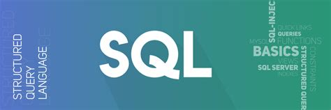

<!-- PROJECT SHIELDS -->
<!--
*** I'm using markdown "reference style" links for readability.
*** Reference links are enclosed in brackets [ ] instead of parentheses ( ).
*** See the bottom of this document for the declaration of the reference variables
*** for contributors-url, forks-url, etc. This is an optional, concise syntax you may use.
*** https://www.markdownguide.org/basic-syntax/#reference-style-links
-->
[![Contributors][contributors-shield]][contributors-url]
[![Forks][forks-shield]][forks-url]
[![Stargazers][stars-shield]][stars-url]
[![Issues][issues-shield]][issues-url]
[![MIT License][license-shield]][license-url]
[![LinkedIn][linkedin-shield]][linkedin-url]

<!-- PROJECT LOGO -->
 

  

  <h3 align="center">Fundamentals Of SQL</h3>

  

    One Pager for SQL Fundamentals!
     
     
    ·
    <a href="https://github.com/doctypehuman/sql/issues">Report Bug</a>
    ·
    <a href="https://github.com/doctypehuman/sql/issues">Request Feature</a>
  

<!-- TABLE OF CONTENTS -->

  
Table of Contents

  <ul>
    <li>
      <a href="#about-the-project">About The Project</a>
    </li>
    <li>
      <a href="#getting-started">Getting Started</a>
      <ul>
        <li><a href="#prerequisites">Prerequisites</a></li>
        <li><a href="#installation">Installation</a></li>
      </ul>
    </li>
    <li>
	<a href="#module-1">Module 1</a>
	<ul>
	<li><a href="#introduction-to-sql">Introduction To SQL</a></li>
	<li><a href="#syntax">Syntax</a></li>
	<li><a href="SQLSELCT">SQL SELECT</a></li>
	</li>
    <li><a href="#contributing">Contributing</a></li>
    <li><a href="#license">License</a></li>
    <li><a href="#contact">Contact</a></li>
    <li><a href="#acknowledgements">Acknowledgements</a></li>
  </ul>

<!-- ABOUT THE PROJECT -->
## About The Project

 In the process of learning something, it is best if you can reproduce what you learnt. Keeping this mantra in mind, I have decided to share what I have learnt about SQL Fundamentals. The project is broken into modules. Each module has different topics that are covered. I will try to include exercises that I have come across as a reference for you. As of now please consider that to be out of scope. For free exercises you can check out [W3Schools.](www.w3schools.com) That is where I have learnt the basics from. I am passing on all of the information so that you do not have to pay to learn. You might still need to pay for a certificate but if you are just starting out and want to get notes, this project should suffice.

<!-- GETTING STARTED -->
## Getting Started

You can use this project to learn SQL either on a MYSQL server or a POSTGRESQL server. The database that is used as an example is Northwinds Databse. This is an example database that you Microsoft created for tutorials. It is available on GitHub [here.](https://github.com/Microsoft/sql-server-samples/tree/master/samples/databases/northwind-pubs)

For a POSTGRESQL server the database that can be used is the DVD Rental Database that can be found [here.](https://sp.postgresqltutorial.com/wp-content/uploads/2019/05/dvdrental.zip)

### Prerequisites

A computer with an internet connection is required. I will not be diving deep into the requirements for different Operating Systems. As and when I do document loading the database on into a machine it will be RHEL8 and also I would like to document how to load the database into a container.

### Installation

*_Pending till further notice_*

<!-- MODULE1 -->
## Module 1

Basic introduction of SQL. It stands for Structured Query Language. In this module you will learn the basics of SQL. You already have learnt what the acronym stands for.

## Introduction To SQL

So we know now what SQL stands for, but what does it do ?? SQL lets you access and manipulate entries in databases. A database is simply put a collection of data. SQL can help you retrieve data, insert data, run queries,create tables, create databases and much more. We will be going over some of the most important abilities below as we progress.

*_SQL IS A STANDARD BUT_*

SQL became a standard of the American National Institute in 1982 and of the International Standard Organization in 1987 _but_ there are different versions of it. However, in order to be compliant to the ANSI and ISO standards they support at least the major commands such as 

- SELECT

- UPDATE 

- DELETE

- INSERT 

- WHERE

and some more.

*RDBMS* 

Relational Database Management System. Now if I am not mistaken, I think it was Oracle that started this concept. Earlier there were databases but they did not talk to each other. It was at Oracle that they devised a way in which these databases could communicate with each other. I could be wrong but I think I am right. Do create a pull request if you think this information can be updated.

RDBMS is the stepping stone for SQL and for all modern databases such as Oracle, IBM DB2, MS SQL Server, POSTGRES.

The data in RDBMS is stored in database objects called tables. A table is a collection of data entries and it consists of rows and columns. Rows are horizontal lines that contain data and Columns are vertical lines that hold data. A record is also called a row and a field is also known as a column.

## Syntax

- Database Tables

Each Database consists of different tables. Each table is given a name for Example Customers, Orders etc. Each table consists of different rows and columns.

- SQL Statements

Most actions that need to be performed on databases are done with SQL Statements. The below statement will select all records from the "Customers" table.

		SELECT * FROM Customers;

SQL is not case sensitive. SELECT is the same as select. 

Semicolons are used to differentiate multiple SQL statements.

*FREQUENT SQL COMMANDS*

- SELECT: Extracts data from the database

- UPDATE: Updates data in the database

- DELETE: Deletes data from a database

- INSERT INTO: Inserts new data into a database

- CREATE DATABASE: Creates a new database

- ALTER DATABASE: Modifies a database

- CREATE TABLE: Creates a table in a database

- ALTER TABLE: Modifies a table

- DROP TABLE: Deletes a table

- CREATE INDEX: Creates an index (search key)

- DROP INDEX: Deletes an index
 

  
<!-- ROADMAP -->
## Roadmap

See the [open issues](https://github.com/othneildrew/Best-README-Template/issues) for a list of proposed features (and known issues).

<!-- CONTRIBUTING -->
## Contributing

Contributions are what make the open source community such an amazing place to be learn, inspire, and create. Any contributions you make are **greatly appreciated**.

1. Fork the Project
2. Create your Feature Branch (`git checkout -b feature/AmazingFeature`)
3. Commit your Changes (`git commit -m 'Add some AmazingFeature'`)
4. Push to the Branch (`git push origin feature/AmazingFeature`)
5. Open a Pull Request

<!-- LICENSE -->
## License

Distributed under the MIT License. See `LICENSE` for more information.

<!-- CONTACT -->
## Contact

Your Name - [@your_twitter](https://twitter.com/your_username) - email@example.com

Project Link: [https://github.com/your_username/repo_name](https://github.com/your_username/repo_name)

<!-- ACKNOWLEDGEMENTS -->
## Acknowledgements
* [GitHub Emoji Cheat Sheet](https://www.webpagefx.com/tools/emoji-cheat-sheet)
* [Img Shields](https://shields.io)
* [Choose an Open Source License](https://choosealicense.com)
* [GitHub Pages](https://pages.github.com)
* [Animate.css](https://daneden.github.io/animate.css)
* [Loaders.css](https://connoratherton.com/loaders)
* [Slick Carousel](https://kenwheeler.github.io/slick)
* [Smooth Scroll](https://github.com/cferdinandi/smooth-scroll)
* [Sticky Kit](http://leafo.net/sticky-kit)
* [JVectorMap](http://jvectormap.com)
* [Font Awesome](https://fontawesome.com)

<!-- MARKDOWN LINKS & IMAGES -->
<!-- https://www.markdownguide.org/basic-syntax/#reference-style-links -->
[contributors-shield]: https://img.shields.io/github/contributors/doctypehuman/Best-README-Template.svg?style=for-the-badge
[contributors-url]: https://github.com/doctypehuman/sql/contributors
[forks-shield]: https://img.shields.io/github/forks/doctypehuman/Best-README-Template.svg?style=for-the-badge
[forks-url]: https://github.com/doctypehuman/sql/network/members
[stars-shield]: https://img.shields.io/github/stars/doctypehuman/Best-README-Template.svg?style=for-the-badge
[stars-url]: https://github.com/doctypehuman/sql/stargazers
[issues-shield]: https://img.shields.io/github/issues/doctypehuman/Best-README-Template.svg?style=for-the-badge
[issues-url]: https://github.com/doctypehuman/sql/issues
[license-shield]: https://img.shields.io/github/license/doctypehuman/Best-README-Template.svg?style=for-the-badge
[license-url]: https://github.com/doctypehuman/sql/blob/master/LICENSE.txt
[linkedin-shield]: https://img.shields.io/badge/-LinkedIn-black.svg?style=for-the-badge&logo=linkedin&colorB=555
[linkedin-url]: https://linkedin.com/in/
roduct-screenshot]: images/screenshot.png
